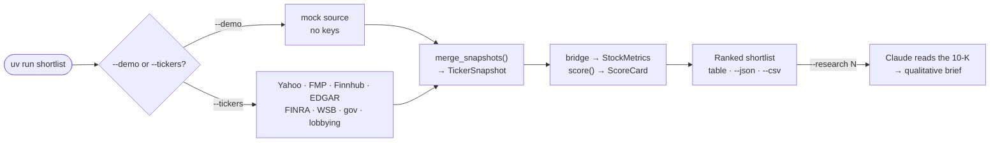

<div align="center">

# shortlist

**Hand it a ticker list. Get back a ranked shortlist worth your judgment.**

Pulls fundamentals from FMP / Finnhub / SEC EDGAR / Yahoo, scores seven axes, and does
the mechanical half of stock research — so your deep dive is spent on fewer, better names.

[](https://www.python.org/)
[](LICENSE)
[](tests/)
[](https://github.com/astral-sh/uv)

</div>

---

## Why shortlist

| | |
|---|---|
| **Multi-source by design** | Each API contributes only the fields it's genuinely best at, merged by priority. Stacking beats any single feed. |
| **Value-tilted** | Value and momentum are weighted *independently* — value pulls ~3× momentum, so undervaluation drives the ranking. |
| **Sector-aware** | Banks, insurers and REITs **abstain** the legs that don't apply to them instead of scoring a misleading number. |
| **Honest about gaps** | Per-provider coverage diagnostics explain every null rather than hiding it. |
| **Free-tier friendly** | Keyless Yahoo prices, SEC EDGAR financials and FINRA short interest, plus an on-disk cache — and `--demo` needs no key at all. |
| **Evidence over vibes** | New scoring legs are gated on reproducible cross-universe rank IC, and the ones that fail get **disabled on the record** — with dated verdicts in [`docs/audits/`](docs/audits/). |

## Quick start

```bash
uv sync                          # core + dev deps, pinned by uv.lock
uv run shortlist --demo          # offline sample basket — no keys needed
```

```
                                         Moat + value screen
┏━━━━━━┳━━━━━━━━┳━━━━━━━┳━━━━━━┳━━━━━━┳━━━━━━┳━━━━━━┳━━━━━━━┳━━━━━━━┳━━━━━━━┳━━━━━━━┳━━━━━━━━┳━━━━━━━┓
┃ Rank ┃ Ticker ┃ Score ┃ Qual ┃ Moat ┃ Grow ┃ Momt ┃ Value ┃ Insdr ┃  Conf ┃  Risk ┃ Upside ┃ Flags ┃
┡━━━━━━╇━━━━━━━━╇━━━━━━━╇━━━━━━╇━━━━━━╇━━━━━━╇━━━━━━╇━━━━━━━╇━━━━━━━╇━━━━━━━╇━━━━━━━╇━━━━━━━━╇━━━━━━━┩
│    1 │ GOOGL  │  65.3 │   95 │   87 │   65 │   54 │    42 │    42 │  1.00 │     - │    13% │ -     │
│    2 │ SCHW   │  63.4 │   64 │    - │   84 │    6 │    82 │    45 │  1.00 │     - │    32% │ -     │
│    3 │ GEV    │  57.5 │   85 │   45 │   78 │   78 │    44 │    27 │  1.00 │     - │    26% │ -     │
│    4 │ TMO    │  44.5 │   48 │   52 │   30 │   18 │    48 │    54 │  1.00 │     - │    22% │ -     │
│    5 │ LMT    │  40.2 │   46 │   52 │   32 │    2 │    40 │    50 │  1.00 │     - │    16% │ -     │
└──────┴────────┴───────┴──────┴──────┴──────┴──────┴───────┴───────┴───────┴───────┴────────┴───────┘
```

Those dashes are the point. SCHW's moat is `-` because it's a broker — the gross-margin and
ROIC legs abstain rather than invent a number. `Risk` is `-` for everyone because the offline
mock basket carries no price history. Neither is scored as a zero, and neither drags the
composite down.

Going live — keys come from the environment or a repo-root `.env`:

```bash
cp .env.example .env             # then fill in your keys (.env is gitignored)
uv run shortlist --tickers GEV,LMT,SCHW,TMO,GOOGL --csv out.csv
```

```bash
export FMP_API_KEY=...            # primary fundamentals
export FINNHUB_API_KEY=...        # insider sentiment + estimate revisions
export SEC_IDENTITY="you@you.com" # required by SEC for EDGAR
```

A missing key just skips that source with a warning, so set only what you need. An explicit
`export` always wins over `.env`.

> **Omit `--provider` on the default path.** It *overrides* the configured source chain, so
> passing it silently drops keyless sources like `yahoo` and `finra`.

## What it scores

Seven sub-scores, each 0–100, every metric normalized over a configurable band:

| Axis | Weight | Built from |
|---|---|---|
| **Quality** | 0.18 | ROE, net margin, interest coverage, leverage (inverted) |
| **Moat** | 0.18 | Gross-margin level + 5y stability + persistent ROIC |
| **Growth** | 0.135 | Revenue / FCF / EPS CAGR + YoY growth persistence |
| **Value** | 0.22 | FCF yield, P/E vs own 5y median, upside to target, PEG |
| **Momentum** | 0.08 | Price vs 200DMA, 6m relative strength vs SPY, revision trend, residual momentum |
| **Insider** | 0.135 | Net Form-4 flow scaled by market cap + insider sentiment |
| **Risk** | 0.10 | Realized volatility + max drawdown, both inverted |

**Gates** are hard filters that disqualify a name (negative FCF, sub-$300M market cap,
over-leverage, heavy insider selling). **Flags** are advisory — `crowded_short`,
`value_trap`, `activist_13d` and a dozen more annotate a name but never move the composite.
Tune all of it in `config.yaml`; no code changes needed.

→ **[docs/SCORING.md](docs/SCORING.md)** for the full method, gates vs flags, and sector abstention.

## How it works



One async `httpx` fetching layer feeds one scorer. Because the keyless Yahoo and EDGAR
sources lead the merge, `value`, `growth`, `momentum` and `risk` still resolve when FMP
gates a symbol — which it does for most non-mega-caps on the free tier.

→ **[HARNESS.md](HARNESS.md)** for the data layer, snapshot format and backtesting.

## Commands

| Command | Purpose |
|---|---|
| `shortlist` | Rank a shortlist (`--demo`, `--json`, `--csv`, `--research N`). HTTP responses cached on disk by default. |
| `shortlist-harness` | Fetch one assessment-ready `TickerSnapshot` per ticker (`--out` to persist). |
| `shortlist-backtest` | Validate scores against forward returns — rank IC + quantile spreads. |
| `shortlist-accumulate` | Capture point-in-time snapshots daily so the replay backtest accrues history. Scheduling is **off** by default. |
| `shortlist-bot` | Interactive Telegram bot. |

## Telegram bot

`shortlist-bot` long-polls Telegram so you can drive screening from your phone. No webhook,
no inbound ports, and it answers **only** your allowlisted chat id.

```bash
uv run shortlist-bot
```

| | |
|---|---|
| `/screen nvda, lmt, msft` | Ranked dashboard in seconds |
| `/deep tsla` | Same, plus the Claude 10-K brief |
| `/portfolio` | Re-screens what you own — exposure, sector concentration, deterioration alerts |
| `/explain 13d` | What a term in these reports means |

→ **[docs/TELEGRAM.md](docs/TELEGRAM.md)** for setup, the full command list and holdings tracking.

## Qualitative research

`--research N` hands the top N non-gated names' latest 10-K to the local `claude` CLI, which
writes a brief: moat read, material risks, red flags, capital allocation, and a falsifiable
bull/bear thesis. Factual findings carry a verbatim filing quote that is **verified to
actually appear in the filing**. It stands alongside the numeric score and never re-ranks.

```bash
uv run shortlist --tickers GEV,LMT,GOOGL --research 3
```

→ **[docs/RESEARCH.md](docs/RESEARCH.md)** for caching, guards and the kill-switch.

## Companion Claude Code skills

Two skills ship in `.claude/skills/` — workflows for Claude Code, not part of the Python
package:

- **`/run`** — end-to-end screening: gather tickers, run the CLI, interpret scores and gaps.
- **`/prospect`** — a web research routine that hunts 5–8 fresh candidates to *feed into* the
  screener. The package itself has no universe scan; you bring the tickers.

## Docs

| Doc | What's in it |
|---|---|
| [HARNESS.md](HARNESS.md) | The async data layer, snapshot format, backtesting |
| [docs/SCORING.md](docs/SCORING.md) | Seven axes, weights, gates vs flags, sector abstention |
| [docs/TELEGRAM.md](docs/TELEGRAM.md) | Bot setup, commands, portfolio tracking |
| [docs/RESEARCH.md](docs/RESEARCH.md) | The Claude 10-K brief layer (`--research N`) |
| [docs/DATA_SOURCES.md](docs/DATA_SOURCES.md) | Every feed and why it earns its place |
| [docs/ASSESSMENT_GAPS.md](docs/ASSESSMENT_GAPS.md) | What is **not** yet validated — read before trusting a weight |
| [docs/PREDICTIVE_SIGNALS_RESEARCH.md](docs/PREDICTIVE_SIGNALS_RESEARCH.md) | Signals measured, shipped, and killed |
| [deploy/README.md](deploy/README.md) | systemd units for an always-on deployment |

<details>
<summary><b>Implementation internals</b></summary>

- [docs/STATEMENTS_MERGE.md](docs/STATEMENTS_MERGE.md) — fiscal-year join rules for merged financials
- [docs/EDGAR_CLIENTS.md](docs/EDGAR_CLIENTS.md) — the SEC/EDGAR client library and its landmines
- [docs/POSITION_MONITOR.md](docs/POSITION_MONITOR.md) — position-monitor design (alerting not armed)
- [docs/audits/](docs/audits/) — dated verdicts for every signal measured, shipped or killed
- [CLAUDE.md](CLAUDE.md) — working notes for Claude Code in this repo

</details>

## Limitations

- **The weights are a prior, not a fitted result.** Only some legs are forward-return
  validated; the risk axis especially is unfitted, since trailing vol and drawdown can be
  anti-predictive at turning points. See [docs/ASSESSMENT_GAPS.md](docs/ASSESSMENT_GAPS.md).
- **This is a triage funnel, not an alpha model.** Validation runs on a small, survivorship-
  biased free-tier universe where most factor legs are statistically indistinguishable from
  noise.
- **Sector handling is masking, not recalibration.** Inapplicable legs abstain, but the
  surviving legs aren't re-tuned per sector — treat cross-sector composites as directional.
- **`--demo` data is illustrative, not verified.** Prices and targets are roughly accurate
  for late May 2026; margins, ROIC and insider figures are placeholders.
- **It's a pre-screen, not advice.** It points the deep dive; it doesn't replace it.

## License

[AGPL-3.0](LICENSE) © Chris Turgeon. Strong copyleft: you're free to use, study, and modify
it, but any distributed fork — **or a modified version run as a network service** — must
make its source available under the same license. This is a research tool, **not financial
advice** — it surfaces candidates for a human deep dive and makes no recommendation to buy
or sell any security.
