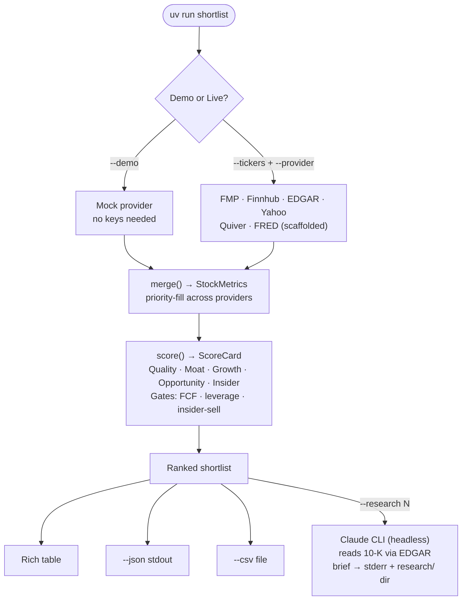
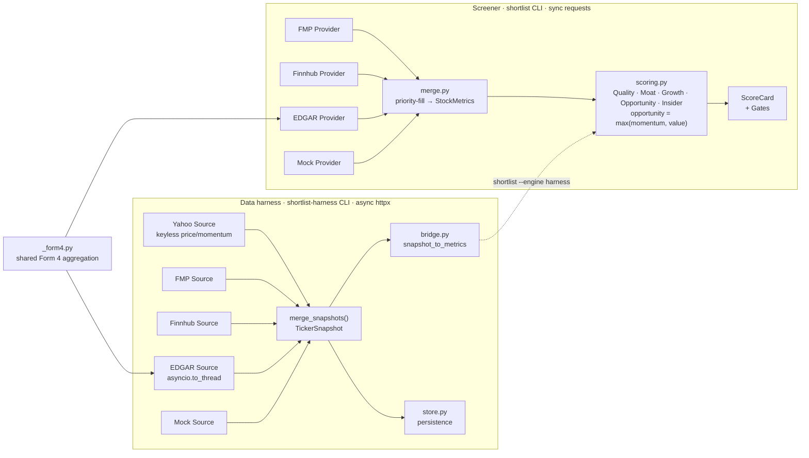

# shortlist

A quantitative pre-screen that automates Phase 2–3 of the `investment-research`
skill: pull fundamentals, score business quality + moat, flag momentum **or**
deep undervaluation, and penalize insider selling — then hand the ranked
shortlist to the skill's filing-level deep dive.

It does the mechanical part so the judgment part is spent on fewer, better names.

## How it works

**User flow** — what goes in, what comes out, what's optional:



**Architecture** — two parallel stacks that don't share fetching code, with a shared Form 4 module:



The two stacks now feed the **same** scorer: `bridge.py:snapshot_to_metrics`
converts a harness `TickerSnapshot` into the `StockMetrics` `scoring.py` consumes,
so `shortlist --engine harness` ranks names off the richer, audited harness data
(including the keyless, gating-immune **Yahoo** momentum source) instead of the
screener providers. `--engine screener` (default) is unchanged.

## Quick start

```bash
# Recommended: uv (reproducible via uv.lock; installs core + dev deps)
uv sync
uv sync --extra edgar            # + SEC EDGAR insider source

# Or plain pip:
#   pip install -e .             # core (requests, pyyaml, rich, python-dotenv)
#   pip install -e ".[edgar]"    # + SEC EDGAR insider source

# Offline demo on the May-2026 candidate basket (no keys needed):
uv run shortlist --demo

# Live run — keys come from the environment or a .env file:
cp .env.example .env             # then fill in your keys (.env is gitignored)
uv run shortlist --tickers GEV,LMT,SCHW,TMO,GOOGL --provider fmp,finnhub,edgar --csv out.csv

# Score off the richer harness stack (Yahoo-led, auditable momentum, gating-immune):
uv run shortlist --tickers GEV,AXON --engine harness
```

Keys can be set either way; an explicit `export` always wins over `.env`:

```bash
export FMP_API_KEY=...            # primary fundamentals
export FINNHUB_API_KEY=...        # insider sentiment + revisions
export SEC_IDENTITY="you@you.com" # required by SEC for EDGAR
```

A missing key just skips that provider with a warning, so set only what you need.

### Command-line tools

Four console scripts ship with the package (see `HARNESS.md` for the data-layer ones):

| Command | Purpose |
|---|---|
| `shortlist` | The screener — rank a shortlist (`--demo`, `--engine harness`, `--research N`). FMP/Finnhub responses are cached on disk by default so repeated runs are cheap; `--no-cache` / `--refresh-cache` control it. |
| `shortlist-harness` | Fetch one assessment-ready `TickerSnapshot` per ticker (`--out` to persist). |
| `shortlist-backtest` | Validate scores against forward returns — rank IC + quantile spreads (`ASSESSMENT_GAPS.md` §2.1). |
| `shortlist-accumulate` | Capture point-in-time snapshots daily so the snapshot-replay backtest accrues history. **Scheduling is off by default** (`deploy/`). |

## Why these data sources (the part that adds the value)

The design principle is **each source contributes only the fields it's genuinely
best at**, merged by priority (`merge.py`). Stacking sources beats any single API.

| Source | What it's best at here | Why it's in the chain |
|---|---|---|
| **FMP** (primary) | ratios, key metrics, price-target consensus, recommendations, insider tx | broadest coverage in the fewest calls — the backbone |
| **Finnhub** (complement) | insider **sentiment** (MSPR), recommendation-trend **deltas**, free real-time quote | clean revision direction + a normalized insider signal FMP doesn't expose as cleanly |
| **SEC EDGAR** via `edgartools` (authoritative) | Form 4 insider buys/sells + **10-K financials (revenue/FCF/EPS)**, 10-K risk/material-weakness text | the *source of record* the paid APIs are derived from; free, no rate limits — best for your "minimal insider selling" criterion; on `--engine harness` the 10-K financials recover FCF yield and P/E-vs-history when FMP gates a symbol |
| **Quiver Quantitative** (optional edge) | congressional trades, **government-contract awards**, lobbying | gov-contract flow is a real, uncorrelated signal for defense/industrial names (LMT, GEV) that no fundamentals feed captures |
| **FRED** (optional macro) | 10y yield, fed funds, 2s10s curve | overlay to tilt the whole run when rates move against rate-sensitive names — not per-stock |
| **Yahoo** chart (wired, harness) | keyless price history → 200dma, 6m rel-strength vs SPY, realized vol, max drawdown | momentum/risk we compute & audit ourselves; immune to FMP's per-symbol gating; leads the harness price merge |

FMP / Finnhub / EDGAR are fully wired in both stacks; **Yahoo** is wired in the
harness (reachable via `--engine harness`). Quiver and FRED are scaffolded in
`providers/extensions.py` with the interface and the specific signals to add —
they're the highest-leverage next additions, in that order.

## How scoring works (`scoring.py`)

Six sub-scores, each 0–100, every metric normalized over a configurable
`[low, high]` band in `config.yaml`:

- **Quality** — ROE, net margin, interest coverage, (inverted) leverage
- **Moat** — gross-margin level + 5y stability + persistent ROIC (excess returns)
- **Growth** — revenue / FCF / EPS CAGR + YoY growth persistence (fundamental compounding)
- **Momentum** — price vs 200DMA, 6m relative strength vs SPY, estimate-revision trend
- **Value** — upside to analyst target, FCF yield, P/E vs own 5y median, PEG (growth-adjusted). On `--engine harness`, FCF yield and P/E-vs-history are recoverable from free EDGAR + Yahoo data, so only analyst-target upside and PEG require FMP.
- **Insider** — net Form-4 flow (scaled by market cap) + insider sentiment

`opportunity = max(momentum, value)` so a name qualifies on **either** axis
rather than being averaged down. Composite is a weighted blend (default
quality 0.20 / moat 0.20 / growth 0.15 / opportunity 0.30 / insider 0.15;
these are a prior to be backtested — see `docs/ASSESSMENT_GAPS.md`). **Gates** are hard
filters (negative FCF, sub-threshold market cap, over-leverage, heavy insider
selling) that flag a name regardless of score.

Tune everything in `config.yaml` — no code changes needed to re-weight.

## Qualitative research (`--research N`)

After ranking, `--research N` reads each of the top N non-gated names' latest
10-K (business, MD&A, risk factors) via SEC EDGAR and uses the local `claude`
CLI to write a qualitative brief — moat read, material risks, red flags,
management/capital-allocation, business model, and a synthesis. It **stands
alongside** the numeric score (never re-ranks). Output: `research/<TICKER>/
<accession>.md` (+ `.json`), cached by filing so re-runs are free; `--refresh`
regenerates.

Factual findings (risks/red flags) carry a verbatim filing quote that is
verified to actually appear in the filing; unverifiable ones are flagged. Needs
the `claude` CLI on PATH (uses your existing CLI auth — no API key) and the
`[edgar]` extra. Briefs are LLM-generated aids for the deep dive, not advice.

    uv run shortlist --tickers GEV,LMT,GOOGL --provider fmp,finnhub,edgar --research 3

## Reading the output

The composite ranks **business quality + opportunity**. It deliberately does
*not* know your existing portfolio — so a name can top the screen on merit yet
still be a poor *addition* if it doubles an exposure you already hold. Use the
ranking to surface candidates; use the skill (and your own allocation judgment)
to decide what actually goes in.

## Autonomous scout

The scout stack discovers candidates from free signal feeds, screens them through
the existing scorer, and ships a daily Telegram report — no watchlist needed.
Full design and rationale: [`docs/AUTONOMOUS_SCOUT.md`](docs/AUTONOMOUS_SCOUT.md).

```bash
# Offline demo — no keys, prints a ranked shortlist (GEV / LMT / GOOGL basket):
uv run shortlist-scout --demo

# Live run — reads keys from .env, discovers candidates, deep-screens, delivers to Telegram:
uv run shortlist-scout
```

**Strictly free.** The scout uses Yahoo Finance (keyless), EDGAR Form 4 daily
index (free SEC feed), Finnhub news volume (free tier), and Wikipedia pageviews
(no key). FMP's free plan limits deep-screening to roughly **15 tickers/day** —
that is intentional: the signal funnel surfaces only the most interesting names
rather than burning quota on noise.

**Kill-switch.** To skip the Claude research phase without redeploying:

```bash
touch scout/STOP_RESEARCH        # file-based; persists
SCOUT_NO_RESEARCH=1 shortlist-scout  # env var; one run
```

For systemd deployment (timer fires at 22:30 UTC daily), see [`deploy/README.md`](deploy/README.md).

## Limitations

- Moat/quality proxies are equity-centric and misfire on banks/insurers
  (SCHW shows blanks for gross margin / ROIC). Add sector-aware thresholds before
  trusting financials cross-sector.
- `--demo` data in `providers/mock.py` is **illustrative**, not verified — prices
  and targets are ~accurate for late May 2026; margins/ROIC/insider are
  placeholders. Run a live provider for real figures.
- This is a pre-screen, not advice. It points the deep dive; it doesn't replace it.
