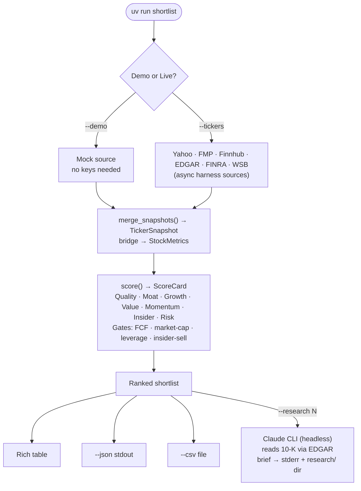
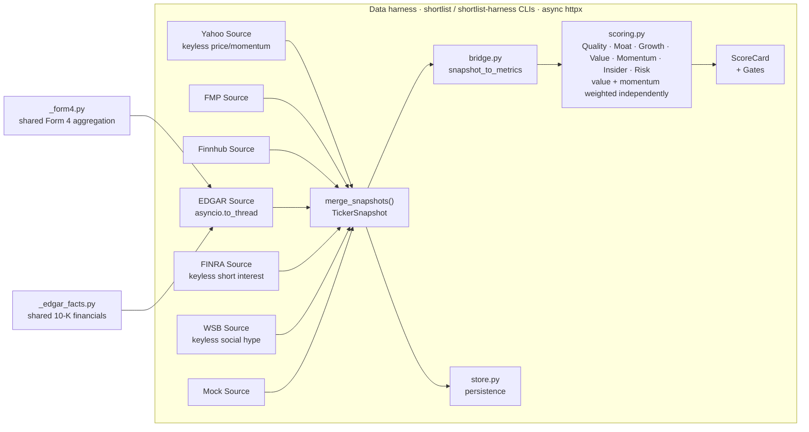

# shortlist

> **A quantitative stock pre-screen that does the mechanical work — so your judgment is spent on fewer, better names.**

[](https://www.python.org/)
[](LICENSE)
[](tests/)
[](https://github.com/astral-sh/uv)

Pull fundamentals from FMP / Finnhub / SEC EDGAR / Yahoo, score seven axes —
**quality, moat, growth, value, momentum, insider activity, and risk** — then
rank a shortlist for a human deep dive. It does the mechanical part of stock
research, so your judgment is spent on fewer, better names.

- **Multi-source by design** — each API contributes only the fields it's genuinely best at, merged by priority. Stacking beats any single feed.
- **Value-tilted** — value and momentum are weighted *independently* (value pulls ~3× momentum), so undervaluation drives the ranking; `opportunity = max(momentum, value)` is kept for display only.
- **Sector-aware** — banks / insurers / REITs abstain the legs that don't apply to them rather than scoring a misleading number.
- **Honest about gaps** — per-provider coverage diagnostics explain every null instead of hiding it.
- **Free-tier friendly** — keyless Yahoo momentum/risk, free SEC EDGAR insider + financials, and an on-disk cache so re-runs cost nothing.

## How it works

**User flow** — what goes in, what comes out, what's optional:



**Architecture** — one async fetching layer (the data harness) feeding the scorer:



`bridge.py:snapshot_to_metrics` converts a harness `TickerSnapshot` into the
`StockMetrics` `scoring.py` consumes, so names are ranked off the richer, audited
data (including the keyless, gating-immune **Yahoo** momentum source and **FINRA**
short interest). The harness recovers `value`, `growth`, and the `risk` axis from
free EDGAR + Yahoo data when FMP gates a symbol (which it does for most non-mega-caps
on the free tier). The only other `StockMetrics`-producing paths are the
point-in-time **XBRL backtest source** and the offline `MockProvider` test fixture
(`--demo` itself uses the harness `mock` Source); `providers/_form4.py` and
`providers/_edgar_facts.py` are dependency-free leaves shared by the harness
`EdgarSource` and the XBRL backtest.

## Quick start

```bash
# Install with uv (reproducible via uv.lock; installs core + dev deps)
uv sync
uv sync --extra edgar            # + SEC EDGAR insider source

# Offline demo on the May-2026 candidate basket (no keys needed):
uv run shortlist --demo

# Live run — keys come from the environment or a .env file:
cp .env.example .env             # then fill in your keys (.env is gitignored)
# The Yahoo-led, auditable, gating-immune harness. Omit --provider so the full
# harness_sources chain (incl. yahoo + finra) is used:
uv run shortlist --tickers GEV,LMT,SCHW,TMO,GOOGL --csv out.csv
```

Keys can be set either way; an explicit `export` always wins over `.env`:

```bash
export FMP_API_KEY=...            # primary fundamentals
export FINNHUB_API_KEY=...        # insider sentiment + revisions
export SEC_IDENTITY="you@you.com" # required by SEC for EDGAR
```

A missing key just skips that provider with a warning, so set only what you need.

### Command-line tools

Six console scripts ship with the package (see `HARNESS.md` for the data-layer ones):

| Command | Purpose |
|---|---|
| `shortlist` | Rank a shortlist (`--demo`, `--research N`). Runs the async harness and bridges its `TickerSnapshot` into the scorer. FMP/Finnhub responses are cached on disk by default so repeated runs are cheap; `--no-cache` / `--refresh-cache` control it. |
| `shortlist-harness` | Fetch one assessment-ready `TickerSnapshot` per ticker (`--out` to persist). |
| `shortlist-backtest` | Validate scores against forward returns — rank IC + quantile spreads (`ASSESSMENT_GAPS.md` §2.1). |
| `shortlist-accumulate` | Capture point-in-time snapshots daily so the snapshot-replay backtest accrues history. **Scheduling is off by default** (`deploy/`). |
| `shortlist-bot` | Interactive Telegram bot — drive screening on demand (`/screen`, `/deep`, `/portfolio`). See [Interactive bot](#interactive-bot). |

## Why these data sources (the part that adds the value)

The design principle is **each source contributes only the fields it's genuinely
best at**, merged by priority (`data/models.py:merge_snapshots`). Stacking sources
beats any single API.

| Source | What it's best at here | Why it's in the chain |
|---|---|---|
| **FMP** (primary) | ratios, key metrics, price-target consensus, recommendations, insider tx | broadest coverage in the fewest calls — the backbone |
| **Finnhub** (complement) | insider **sentiment** (MSPR), recommendation-trend **deltas**, free real-time quote | clean revision direction + a normalized insider signal FMP doesn't expose as cleanly |
| **SEC EDGAR** via `edgartools` (authoritative) | Form 4 insider buys/sells + **10-K financials (revenue/FCF/EPS)**, 10-K risk/material-weakness text | the *source of record* the paid APIs are derived from; free, no rate limits — best for your "minimal insider selling" criterion; the 10-K financials recover FCF yield and P/E-vs-history when FMP gates a symbol |
| **Quiver Quantitative** (largely superseded) | congressional trades, government-contract awards, lobbying | gov contracts + lobbying now ship keyless (USAspending / Senate LDA); congressional copy-trading shows no post-STOCK-Act aggregate alpha — see `docs/PREDICTIVE_SIGNALS_RESEARCH.md` |
| **FRED** (optional macro) | 10y yield, fed funds, 2s10s curve | overlay to tilt the whole run when rates move against rate-sensitive names — not per-stock |
| **Yahoo** chart (wired) | keyless price history → 200dma, 6m rel-strength vs SPY, realized vol, max drawdown | momentum/risk we compute & audit ourselves; immune to FMP's per-symbol gating; leads the harness price merge |

FMP, Finnhub, EDGAR, **Yahoo**, **FINRA**, and **WSB** are all wired as harness
sources (`data/sources.py`). **FRED is now wired** as a run-level macro overlay
(`data/macro.py` — risk-off regime, display + advisory only, needs a free
`FRED_API_KEY`), not as a per-ticker source. **Quiver** remains scaffolded in
`providers/extensions.py` but is largely superseded — gov contracts and lobbying
now ship keyless (USAspending / Senate LDA), and its remaining feed, congressional
trades, is a contested prior with no post-STOCK-Act aggregate alpha (verdict in
`docs/PREDICTIVE_SIGNALS_RESEARCH.md` → deferred/rejected).

## How scoring works (`scoring.py`)

Seven sub-scores, each 0–100, every metric normalized over a configurable
`[low, high]` band in `config.yaml`:

- **Quality** — ROE, net margin, interest coverage, (inverted) leverage
- **Moat** — gross-margin level + 5y stability + persistent ROIC (excess returns)
- **Growth** — revenue / FCF / EPS CAGR + YoY growth persistence (fundamental compounding)
- **Momentum** — price vs 200DMA, 6m relative strength vs SPY, estimate-revision trend
- **Value** — upside to analyst target, FCF yield, P/E vs own 5y median, PEG (growth-adjusted). FCF yield and P/E-vs-history are recoverable from free EDGAR + Yahoo data when FMP gates a symbol, so only analyst-target upside and PEG require FMP.
- **Insider** — net Form-4 flow (scaled by market cap) + insider sentiment
- **Risk** — realized volatility + max drawdown (both inverted: safer scores higher). A composite-only tilt — sector-neutral and never masked, but excluded from `confidence`. An unfitted prior (trailing vol/drawdown can be anti-predictive at turning points) — backtest before trusting (`docs/ASSESSMENT_GAPS.md`).

**Value and momentum are weighted independently** (value-tilt: default value 0.22 /
momentum 0.08 — value pulls ~3× momentum); `opportunity = max(momentum, value)` is
retained for display only and does not feed the composite. Composite is a weighted
blend (default quality 0.18 / moat 0.18 / growth 0.135 / value 0.22 / momentum 0.08 /
insider 0.135 / risk 0.10; these are a prior to be backtested — see `docs/ASSESSMENT_GAPS.md`).
**Gates** are hard filters (negative FCF, sub-threshold market cap, over-leverage,
heavy insider selling) that flag a name regardless of score. Soft **flags** (e.g.
`crowded_short`, from the keyless FINRA short-interest
source; `value_trap`, when a cheap name has weak quality/growth — optionally refined by
a Piotroski-style fundamental-quality check) are advisory — they annotate a name but
never change the composite.

Tune everything in `config.yaml` — no code changes needed to re-weight.

### Sector-aware abstention

For businesses whose metrics don't apply — banks/brokers, insurers, REITs (detected
by SEC SIC code) — the structurally-undefined legs (gross margin, FCF yield, ROIC,
leverage) **abstain** instead of being silently averaged into a misleading number,
and the false-positive `over_leveraged` / `negative_fcf` gates are suppressed. Each
card reports `sic_bucket`, a `confidence` (data completeness over *applicable*
components), `scored` (false when too little valid signal survives), and an
`abstentions` list — all in `--json` (and `scored`/`sic_bucket` CSV columns).
`passed` requires `not gates and scored`, and rankings demote not-scored names. An
unknown sector is a no-op (scored exactly as before). v1 *masks* inapplicable legs;
sector-specific *recalibration* of the surviving ones is future work. Configure via
`config.yaml: sectors` + `validity`.

## Qualitative research (`--research N`)

After ranking, `--research N` reads each of the top N non-gated names' latest
10-K (business, MD&A, risk factors) via SEC EDGAR and uses the local `claude`
CLI to write a qualitative brief — moat read, material risks, red flags,
management/capital-allocation, business model, and a falsifiable thesis
(bull/bear/what-would-change-my-mind) plus a score-vs-filing reconciliation. It **stands
alongside** the numeric score (never re-ranks). Output: `research/<TICKER>/
<accession>.md` (+ `.json`), cached by filing so re-runs are free; `--refresh`
regenerates.

Factual findings (risks/red flags) carry a verbatim filing quote that is
verified to actually appear in the filing; unverifiable ones are flagged. Needs
the `claude` CLI on PATH (uses your existing CLI auth — no API key) and the
`[edgar]` extra. Briefs are LLM-generated aids for the deep dive, not advice.

    uv run shortlist --tickers GEV,LMT,GOOGL --provider fmp,finnhub,edgar --research 3

## Reading the output

The composite ranks **business quality + value** (with momentum a lighter tilt). The
composite itself is portfolio-blind — a name can top the screen on merit yet still be a
poor *addition* if it doubles an exposure you already hold. Use the ranking to surface
candidates; use your own allocation judgment to decide what actually goes in. (The
bot's `/portfolio` command closes part of this gap: it re-screens what you *own* and
reports your exposure + sector concentration alongside the same scores — see
[Interactive bot](#interactive-bot).)

## Telegram bot

`shortlist-bot` long-polls Telegram so you drive screening by chatting — `/screen nvda,
lmt, msft` returns the ranked dashboard in seconds, `/deep tsla` adds the Claude 10-K
brief, and `/portfolio` re-screens your own holdings for exposure + deterioration alerts.
No webhook / inbound ports; it only answers your allowlisted chat.

> **The autonomous scout was retired on 2026-08-11.** It discovered candidates nightly from
> free signal feeds and pushed a daily report. Every originator that reached the validation
> evaluator came back INSUFFICIENT or KILL, the apparatus that could settle the rest was
> blocked on a paid price feed, and the stack was 47% of the source and 59% of the tests.
> Decision, evidence, and what survives:
> [`docs/audits/2026-08-11-scout-retirement.md`](docs/audits/2026-08-11-scout-retirement.md).
> Discovery is now your own research feeding `/screen` and `/deep`.

Report delivery (Telegram + file artifact) and the inbound interactive path:
[`docs/NOTIFICATIONS.md`](docs/NOTIFICATIONS.md).

### Interactive bot

`shortlist-bot` turns the screen into a chat assistant — you drive it instead of a
fixed watchlist. It long-polls Telegram (no webhook, no inbound ports) and answers **only**
your allowlisted `TELEGRAM_CHAT_ID`; every other sender is silently ignored.

```bash
uv run shortlist-bot           # starts the long-poll loop (Ctrl-C to stop)
```

| Command | Reply |
|---------|-------|
| `/screen nvda, lmt, msft` | Ranked dashboard (PNG chart + HTML deep-dive), seconds. Comma/space-separated, case-insensitive. |
| `/deep tsla` | Same, plus the Claude 10-K research brief (slower — opt-in). |
| `/add NVDA 12` | Track a holding (shares optional; paste several: `/add NVDA, MSFT, LMT`). |
| `/thesis NVDA <why you own it>` | Record why you own a tracked holding (the only command taking free-text prose). |
| `/hold NVDA <note>` | Log that you saw an alert and chose to keep the position. |
| `/remove NVDA <reason>` | Stop tracking a holding (non-destructive; alias `/sold`). |
| `/portfolio` | Re-screens your own holdings from the bot-owned `positions.json` store: exposure weights, sector concentration, and per-holding deterioration alerts. No arguments. |
| `/help` | Command list. |

It reuses the exact scorer and report pipeline as the daily push. Soft per-request caps
(`bot.max_screen` / `bot.max_deep` in `config.yaml`) bound reply latency; the HTTP cache
makes warm re-screens free. It shares the bot token with the daily push — polling and
sending coexist, only **two concurrent pollers** conflict (run one instance). Always-on
systemd unit: [`deploy/shortlist-bot.service`](deploy/shortlist-bot.service) (see
[`deploy/README.md`](deploy/README.md)).

**Holdings (`/portfolio`).** Positions live in a bot-owned `positions.json` store
(gitignored, atomic writes — `config.yaml: portfolio.store`), not a hand-edited CSV. Track a
position with `/add NVDA 12` (shares optional; bulk `/add NVDA, MSFT, LMT`), optionally record
`/thesis NVDA <why you own it>`, and drop one with `/remove NVDA <reason>` (non-destructive —
alias `/sold`). `/hold NVDA <note>` logs that you saw an alert and chose to keep the
position. `/hold` and `/remove` append to a `decisions.jsonl` ledger (`config.yaml:
portfolio.decisions`); `/remove` embeds the full position record first, so it is recoverable.

`/portfolio` then screens your tracked names and replies with the usual report plus a
**Portfolio** section: position weights, sector concentration, and alerts on any holding
that trips a gate, fires a flag, isn't scored, or comes back as an unknown ticker. No
brokerage sync, no cost basis. A portfolio larger than `portfolio.max_holdings` (default 50)
is screened up to the cap with an explicit "alerts incomplete" warning naming the
un-screened tickers — never a silent drop.

The daily digest also carries a **Holdings watch** section: a held ticker hit by a fresh
clean-negative 8-K (bankruptcy, debt acceleration, or a coming restatement) surfaces once,
plain-English first, with a link to the filer's EDGAR 8-K list — a filings watch, not a
selling system (see [`docs/POSITION_MONITOR.md`](docs/POSITION_MONITOR.md)).

### Telegram delivery setup

Both `shortlist-bot` and the daily push authenticate with the same two variables in the
repo-root `.env` (copy from `.env.example`):

```bash
TELEGRAM_BOT_TOKEN=123456789:AAE...   # from @BotFather: /newbot → HTTP API token
TELEGRAM_CHAT_ID=987654321            # your chat id (see below)
```

1. **Create the bot.** In Telegram, message [@BotFather](https://t.me/BotFather),
   send `/newbot`, follow the prompts, and copy the **HTTP API token** it returns
   into `TELEGRAM_BOT_TOKEN`. Telegram's own walkthrough:
   [core.telegram.org/bots/features#botfather](https://core.telegram.org/bots/features#botfather)
   and the [bot tutorial](https://core.telegram.org/bots/tutorial).
2. **Find your chat id.** Send any message to your new bot, then open
   `https://api.telegram.org/bot<TOKEN>/getUpdates` in a browser and read
   `result[].message.chat.id` — that number is `TELEGRAM_CHAT_ID`. (Alternatively,
   DM [@userinfobot](https://t.me/userinfobot), which replies with your id.)

Both keys live in `.env` (never in `config.yaml`) per the secrets house rule. The bot
picks them up on restart. Full delivery semantics:
[`docs/NOTIFICATIONS.md`](docs/NOTIFICATIONS.md).

**Kill-switch.** To skip the Claude research phase behind `/deep` without redeploying:

```bash
touch research/STOP_RESEARCH     # file-based; persists
SHORTLIST_NO_RESEARCH=1 ...      # env var; one process
```

For systemd deployment — the always-on `shortlist-bot.service` and the opt-in
`shortlist-accumulate.timer` — see [`deploy/README.md`](deploy/README.md).

## Limitations

- Moat/quality proxies are equity-centric. Banks / insurers / REITs (detected by
  SEC SIC code) now **abstain** the structurally-undefined legs rather than score a
  misleading number — but sector-specific *recalibration* of the surviving legs is
  still future work, so treat cross-sector composites as directional.
- The default weights — and the new **risk** axis especially — are a hand-set prior,
  not a fitted result. Only the momentum signal is forward-return validated today;
  see `docs/ASSESSMENT_GAPS.md`.
- `--demo` data in `providers/mock.py` is **illustrative**, not verified — prices
  and targets are ~accurate for late May 2026; margins/ROIC/insider are
  placeholders. Run a live provider for real figures.
- This is a pre-screen, not advice. It points the deep dive; it doesn't replace it.

## License

[AGPL-3.0](LICENSE) © Chris Turgeon. Strong copyleft: you're free to use, study,
and modify it, but any distributed fork — **or a modified version run as a network
service** — must make its source available under the same license. This is a
research tool, **not financial advice** — it surfaces candidates for a human deep
dive and makes no recommendation to buy or sell any security.
